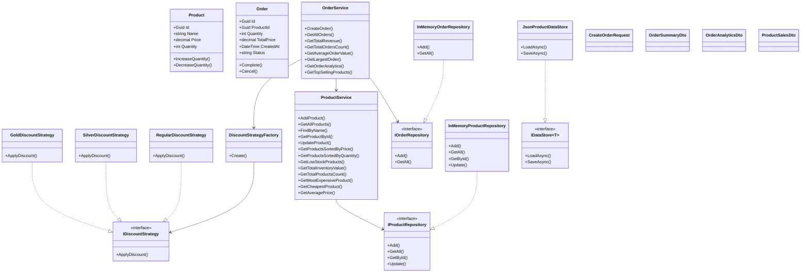

# Class Diagram

```mermaid
classDiagram

class Product {
    +Guid Id
    +string Name
    +decimal Price
    +int Quantity

    +IncreaseQuantity()
    +DecreaseQuantity()
}

class Order {
    +Guid Id
    +Guid ProductId
    +int Quantity
    +decimal TotalPrice
    +DateTime CreatedAt
    +string Status

    +Complete()
    +Cancel()
}

class ProductService {
    +AddProduct()
    +GetAllProducts()
    +FindByName()
    +GetProductById()
    +UpdateProduct()

    +GetProductsSortedByPrice()
    +GetProductsSortedByQuantity()

    +GetLowStockProducts()

    +GetTotalInventoryValue()
    +GetTotalProductsCount()

    +GetMostExpensiveProduct()
    +GetCheapestProduct()

    +GetAveragePrice()
}

class OrderService {
    +CreateOrder()

    +GetAllOrders()

    +GetTotalRevenue()
    +GetTotalOrdersCount()
    +GetAverageOrderValue()

    +GetLargestOrder()

    +GetOrderAnalytics()
    +GetTopSellingProducts()
}

class IDiscountStrategy {
    <<interface>>
    +ApplyDiscount()
}

class GoldDiscountStrategy {
    +ApplyDiscount()
}

class SilverDiscountStrategy {
    +ApplyDiscount()
}

class RegularDiscountStrategy {
    +ApplyDiscount()
}

class DiscountStrategyFactory {
    +Create()
}

class IProductRepository {
    <<interface>>
    +Add()
    +GetAll()
    +GetById()
    +Update()
}

class IOrderRepository {
    <<interface>>
    +Add()
    +GetAll()
}

class InMemoryProductRepository {
    +Add()
    +GetAll()
    +GetById()
    +Update()
}

class InMemoryOrderRepository {
    +Add()
    +GetAll()
}

class IDataStore~T~ {
    <<interface>>
    +LoadAsync()
    +SaveAsync()
}

class JsonProductDataStore {
    +LoadAsync()
    +SaveAsync()
}

class CreateOrderRequest

class OrderSummaryDto

class OrderAnalyticsDto

class ProductSalesDto

ProductService --> IProductRepository
OrderService --> IOrderRepository

InMemoryProductRepository ..|> IProductRepository
InMemoryOrderRepository ..|> IOrderRepository

GoldDiscountStrategy ..|> IDiscountStrategy
SilverDiscountStrategy ..|> IDiscountStrategy
RegularDiscountStrategy ..|> IDiscountStrategy

DiscountStrategyFactory --> IDiscountStrategy

JsonProductDataStore ..|> IDataStore~T~

OrderService --> DiscountStrategyFactory
OrderService --> ProductService
```
