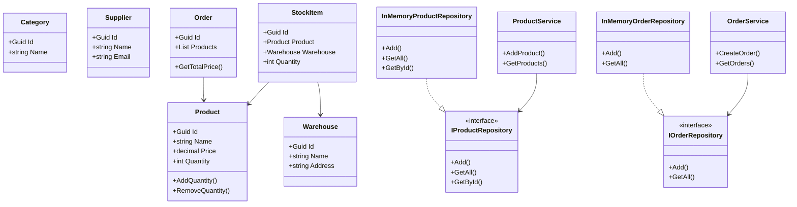

# Class Diagram

```mermaid
classDiagram

class Product {
    +Guid Id
    +string Name
    +decimal Price
    +int Quantity
    +AddQuantity()
    +RemoveQuantity()
}

class Category {
    +Guid Id
    +string Name
}

class Supplier {
    +Guid Id
    +string Name
    +string Email
}

class Warehouse {
    +Guid Id
    +string Name
    +string Address
}

class StockItem {
    +Guid Id
    +Product Product
    +Warehouse Warehouse
    +int Quantity
}

class Order {
    +Guid Id
    +List<Product> Products
    +GetTotalPrice()
}

class ProductService {
    +AddProduct()
    +GetProducts()
}

class OrderService {
    +CreateOrder()
    +GetOrders()
}

class IProductRepository {
    <<interface>>
    +Add()
    +GetAll()
    +GetById()
}

class IOrderRepository {
    <<interface>>
    +Add()
    +GetAll()
}

class InMemoryProductRepository {
    +Add()
    +GetAll()
    +GetById()
}

class InMemoryOrderRepository {
    +Add()
    +GetAll()
}

ProductService --> IProductRepository
OrderService --> IOrderRepository

InMemoryProductRepository ..|> IProductRepository
InMemoryOrderRepository ..|> IOrderRepository

StockItem --> Product
StockItem --> Warehouse

Order --> Product
```
