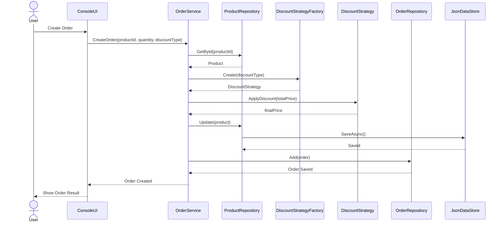

# Sequence Diagram — Order Processing

```mermaid
sequenceDiagram

actor User

participant ConsoleUI
participant OrderService
participant ProductRepository
participant DiscountStrategyFactory
participant DiscountStrategy
participant OrderRepository
participant JsonDataStore

User ->> ConsoleUI: Create Order

ConsoleUI ->> OrderService: CreateOrder(productId, quantity, discountType)

OrderService ->> ProductRepository: GetById(productId)

ProductRepository -->> OrderService: Product

OrderService ->> DiscountStrategyFactory: Create(discountType)

DiscountStrategyFactory -->> OrderService: DiscountStrategy

OrderService ->> DiscountStrategy: ApplyDiscount(totalPrice)

DiscountStrategy -->> OrderService: finalPrice

OrderService ->> ProductRepository: Update(product)

ProductRepository ->> JsonDataStore: SaveAsync()

JsonDataStore -->> ProductRepository: Saved

OrderService ->> OrderRepository: Add(order)

OrderRepository -->> OrderService: Order Saved

OrderService -->> ConsoleUI: Order Created

ConsoleUI -->> User: Show Order Result
```
